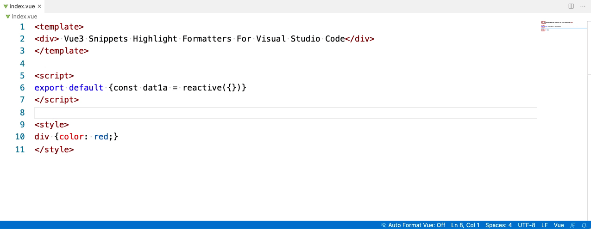
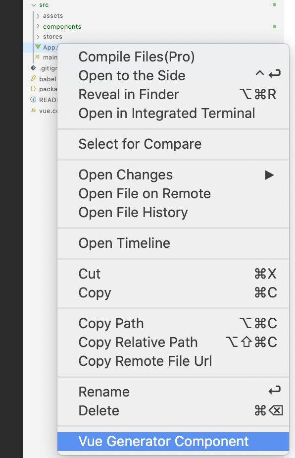

<a href="https://marketplace.visualstudio.com/items?itemName=Wscats.vue"></a>
<a href="https://marketplace.visualstudio.com/items?itemName=Wscats.vue"></a>
<a href="https://github.com/Wscats/vue-snippets"></a>
<a href="https://github.com/Wscats"></a>

[English](https://github.com/Wscats/vue-snippets/blob/master/README.md) | [中文](https://gitee.com/wscats/vue-snippets/blob/master/README.CN.md)

# Vue 2/3 代码片段 语法高亮 格式化插件

这是一款在 Vue 2 或者 Vue 3 开发中提供代码片段，语法高亮和格式化的 VS Code 插件，能极大提高你的开发效率。

<!--  -->


你可以在 VS Code 编辑器底部栏右下角打开 `Auto Format Vue` 开关，它可能帮你在代码保存的时候自动格式化 `vue` 文件的格式，默认是关闭状态。

如果你不想自动格式化 `vue` 文件，你也可以在 `vue` 文件中点击鼠标右键，在出现的菜单栏中选择 `Format Document` 菜单项，则文件会执行一次格式化。

<!--  -->


你可以在文件夹右键的菜单栏中使用 `Vue Generator Component` ，弹窗中填入组件名，会自动生成一个默认组件模板，便于你快速创建一个组件。

<!--  -->



# 代码片段

## Vue 3 代码片段

包含常用 Vue3 代码片段，比如你输入 `reactive`，选择 `reactive` 的代码片段，则编辑器会自动帮你生成 `const data = reactive({...})` 代码，提高你的开发效率。

| 关键字            | JavaScript 代码片段                                     |
| ----------------- | ------------------------------------------------------- |
| `import`          | `import {...} from "@vue/composition-api"`              |
| `import`          | `import {...} from 'vue'`                               |
| `newVue`          | `newVue({...})`                                         |
| `defineComponent` | `defineComponent({...})`                                |
| `export`          | `export default { ... }`                                |
| `setup`           | `setup(${...}) {...}`                                   |
| `reactive`        | `const data = reactive({...})`                          |
| `watch`           | `watch(..., ...)`                                       |
| `watchFn`         | `watch(() => {...})`                                    |
| `watchArray`      | `watch([...]) => {...}`                                 |
| `watchEffect`     | `watchEffect(() => {...})`                              |
| `computed`        | `computed(() => { get: () => {...}, set: () => {...}})` |
| `toRefs`          | `toRefs(...)`                                           |
| `ref`             | `ref(...)`                                              |
| `props`           | `props(...)`                                            |
| `onBeforeMount`   | `onBeforeMount(...)`                                    |
| `onMounted`       | `onMounted(...)`                                        |
| `onBeforeUpdate`  | `onBeforeUpdate(...)`                                   |
| `onUpdated`       | `onUpdated(...)`                                        |
| `onBeforeUnmount` | `onBeforeUnmount(...)`                                  |
| `onUnmounted`     | `onUnmounted(...)`                                      |
| `onErrorCaptured` | `onErrorCaptured(...)`                                  |

## Vue 2 代码片段

兼容所有常用 Vue 2 代码片段，如下：

| 关键字                           | JavaScript 代码片段                                                |
| -------------------------------- | ------------------------------------------------------------------ |
| `import`                         | `import ... from ...`                                              |
| `newVue`                         | `new Vue({...})`                                                   |
| `VueConfigSilent`                | `Vue.config.silent = true`                                         |
| `VueConfigOptionMergeStrategies` | `Vue.config.optionMergeStrategies`                                 |
| `VueConfigDevtools`              | `Vue.config.devtools = true`                                       |
| `VueConfigErrorHandler`          | `Vue.config.errorHandler = function (err, vm, info) {...}`         |
| `VueConfigWarnHandler`           | `Vue.config.warnHandler = function (msg, vm, trace) {...}`         |
| `VueConfigIgnoredElements`       | `Vue.config.ignoredElements = ['']` \                              |
| `VueConfigKeyCodes`              | `Vue.config.keyCodes`                                              |
| `VueConfigPerformance`           | `Vue.config.performance = true`                                    |
| `VueConfigProductionTip`         | `Vue.config.productionTip = false`                                 |
| `vueExtend`                      | `Vue.extend( options )`                                            |
| `VueNextTick`                    | `Vue.nextTick( callback, [context] )`                              |
| `VueNextTickThen`                | `Vue.nextTick( callback, [context] ).then(function(){ })`          |
| `VueSet`                         | `Vue.set( target, key, value )`                                    |
| `VueDelete`                      | `Vue.delete( target, key )`                                        |
| `VueDirective`                   | `Vue.directive( id, [definition] )`                                |
| `VueFilter`                      | `Vue.filter( id, [definition] )`                                   |
| `VueComponent`                   | `Vue.component( id, [definition] )`                                |
| `VueUse`                         | `Vue.use( plugin )`                                                |
| `VueMixin`                       | `Vue.mixin({ mixin })`                                             |
| `VueCompile`                     | `Vue.compile( template )`                                          |
| `VueVersion`                     | `Vue.version`                                                      |
| `data`                           | `data() { return {} }`                                             |
| `watchWithOptions`               | `key: { deep: true, immediate: true, handler: function () { } }`   |
| `vmData`                         | `${this, vm}.$data`                                                |
| `vmProps`                        | `${this, vm}.$props`                                               |
| `vmEl`                           | `${this, vm}.$el`                                                  |
| `vmOptions`                      | `${this, vm}.$options`                                             |
| `vmParent`                       | `${this, vm}.$parent`                                              |
| `vmRoot`                         | `${this, vm}.$root`                                                |
| `vmChildren`                     | `${this, vm}.$children`                                            |
| `vmSlots`                        | `${this, vm}.$slots`                                               |
| `vmScopedSlots`                  | `${this, vm}.$scopedSlots.default({})`                             |
| `vmRefs`                         | `${this, vm}.$refs`                                                |
| `vmIsServer`                     | `${this, vm}.$isServer`                                            |
| `vmAttrs`                        | `${this, vm}.$attrs`                                               |
| `vmListeners`                    | `${this, vm}.listeners`                                            |
| `vmWatch`                        | `${this, vm}.$watch( expOrFn, callback, [options] )`               |
| `vmSet`                          | `${this, vm}.$set( object, key, value )`                           |
| `vmDelete`                       | `${this, vm}.$delete( object, key )`                               |
| `vmOn`                           | `${this, vm}.$on( event, callback )`                               |
| `vmOnce`                         | `${this, vm}.$once( event, callback )`                             |
| `vmOff`                          | `${this, vm}.$off( [event, callback] )`                            |
| `vmEmit`                         | `${this, vm}.$emit( event, […args] )`                              |
| `vmMount`                        | `${this, vm}.$mount( [elementOrSelector] )`                        |
| `vmForceUpdate`                  | `${this, vm}.$forceUpdate()`                                       |
| `vmNextTick`                     | `${this, vm}.$nextTick( callback )`                                |
| `vmDestroy`                      | `${this, vm}.$destroy()`                                           |
| `renderer`                       | `const renderer = require('vue-server-renderer').createRenderer()` |
| `createRenderer`                 | `createRenderer({ })`                                              |
| `preventDefault`                 | `preventDefault();`                                                |
| `stopPropagation`                | `stopPropagation();`                                               |

<br />

| 关键字                 | HTML 代码片段                           |
| ---------------------- | --------------------------------------- |
| `template`             | `<template></template>`                 |
| `script`               | `<script></script>`                     |
| `style`                | `<style></style>`                       |
| `vText`                | `v-text=msg`                            |
| `vHtml`                | `v-html=html`                           |
| `vShow`                | `v-show`                                |
| `vIf`                  | `v-if`                                  |
| `vElse`                | `v-else`                                |
| `vElseIf`              | `v-else-if`                             |
| `vForWithoutKey`       | `v-for`                                 |
| `vFor`                 | `v-for="" :key=""`                      |
| `vOn`                  | `v-on`                                  |
| `vBind`                | `v-bind`                                |
| `vModel`               | `v-model`                               |
| `vPre`                 | `v-pre`                                 |
| `vCloak`               | `v-cloak`                               |
| `vOnce`                | `v-once`                                |
| `key`                  | `:key`                                  |
| `ref`                  | `ref`                                   |
| `slotA`                | `slot=""`                               |
| `slotE`                | `<slot></slot>`                         |
| `slotScope`            | `slot-scope=""`                         |
| `component`            | `<component :is=''></component>`        |
| `keepAlive`            | `<keep-alive></keep-alive>`             |
| `transition`           | `<transition></transition>`             |
| `transitionGroup`      | `<transition-group></transition-group>` |
| `enterClass`           | `enter-class=''`                        |
| `leaveClass`           | `leave-class=''`                        |
| `appearClass`          | `appear-class=''`                       |
| `enterToClass`         | `enter-to-class=''`                     |
| `leaveToClass`         | `leave-to-class=''`                     |
| `appearToClass`        | `appear-to-class=''`                    |
| `enterActiveClass`     | `enter-active-class=''`                 |
| `leaveActiveClass`     | `leave-active-class=''`                 |
| `appearActiveClass`    | `appear-active-class=''`                |
| `beforeEnterEvent`     | `@before-enter=''`                      |
| `beforeLeaveEvent`     | `@before-leave=''`                      |
| `beforeAppearEvent`    | `@before-appear=''`                     |
| `enterEvent`           | `@enter=''`                             |
| `leaveEvent`           | `@leave=''`                             |
| `appearEvent`          | `@appear=''`                            |
| `afterEnterEvent`      | `@after-enter=''`                       |
| `afterLeaveEvent`      | `@after-leave=''`                       |
| `afterAppearEvent`     | `@after-appear=''`                      |
| `enterCancelledEvent`  | `@enter-cancelled=''`                   |
| `leaveCancelledEvent`  | `@leave-cancelled=''`                   |
| `appearCancelledEvent` | `@appear-cancelled=''`                  |

<br />

| 关键字                       | Vue Router 代码片段                            |
| ---------------------------- | ---------------------------------------------- |
| `routerLink`                 | `<router-link></router-link>`                  |
| `routerView`                 | `<router-view></router-view>`                  |
| `to`                         | `to=""`                                        |
| `tag`                        | `tag=""`                                       |
| `newVueRouter`               | `const router = newVueRouter({ })`             |
| `routerBeforeEach`           | `router.beforeEach((to, from, next) => { }`    |
| `routerBeforeResolve`        | `router.beforeResolve((to, from, next) => { }` |
| `routerAfterEach`            | `router.afterEach((to, from) => { }`           |
| `routerPush`                 | `router.push()`                                |
| `routerReplace`              | `router.replace()`                             |
| `routerGo`                   | `router.back()`                                |
| `routerBack`                 | `router.push()`                                |
| `routerForward`              | `router.forward()`                             |
| `routerGetMatchedComponents` | `router.getMatchedComponents()`                |
| `routerResolve`              | `router.resolve()`                             |
| `routerAddRoutes`            | `router.addRoutes()`                           |
| `routerOnReady`              | `router.onReady()`                             |
| `routerOnError`              | `router.onError()`                             |
| `routes`                     | `routes: []`                                   |
| `beforeEnter`                | `beforeEnter: (to, from, next) => { }`         |
| `beforeRouteEnter`           | `beforeRouteEnter (to, from, next) { }`        |
| `beforeRouteLeave`           | `beforeRouteLeave (to, from, next) { }`        |
| `scrollBehavior`             | `scrollBehavior (to, from, savedPosition) { }` |

<br />

| 关键字             | Vuex 代码片段                         |
| ------------------ | ------------------------------------- |
| `newVuexStore`     | `const store = new Vuex.Store({})`    |
| `mapGetters`       | `import { mapGetters } from 'vuex'`   |
| `mapMutations`     | `import { mapMutations } from 'vuex'` |
| `mapActions`       | `import { mapActions } from 'vuex'`   |
| `state`            | `state`                               |
| `mutations`        | `mutations`                           |
| `actions`          | `actions`                             |
| `modules`          | `modules`                             |
| `plugins`          | `plugins`                             |
| `dispatch`         | `dispatch`                            |
| `subscribe`        | `subscribe`                           |
| `registerModule`   | `registerModule`                      |
| `unregisterModule` | `unregisterModule`                    |
| `hotUpdate`        | `hotUpdate`                           |

<br />

| 关键字      | Nuxt.js 代码片段     |
| ----------- | -------------------- |
| `nuxt`      | `<nuxt/>`            |
| `nuxtChild` | `<nuxt-child/>`      |
| `nuxtLink`  | `<nuxt-link to=""/>` |
| `asyncData` | `asyncData() {}`     |

<!-- </details> -->

# 插件设置

你可以在插件的选项中自定义代码格式化的格式，便于定制你的 `vue` 代码格式，配置参数如下：

```json
vue3snippets.arrowParens
vue3snippets.bracketSpacing
vue3snippets.endOfLine
vue3snippets.htmlWhitespaceSensitivity
vue3snippets.insertPragma
vue3snippets.jsxBracketSameLine
vue3snippets.jsxSingleQuote
vue3snippets.printWidth
vue3snippets.proseWrap
vue3snippets.quoteProps
vue3snippets.requirePragma
vue3snippets.semi
vue3snippets.singleQuote
vue3snippets.tabWidth
vue3snippets.trailingComma
vue3snippets.useTabs
vue3snippets.vueIndentScriptAndStyle
```

| 键值                                    | 例子                          | 默认值     |
| -------------------------------------- | ----------------------------- | --------- |
| vue3snippets.printWidth                | 10/20/30/40/n                 | 80        |
| vue3snippets.tabWidth                  | 1/2/3/4/n                     | 2         |
| vue3snippets.singleQuote               | false/true                    | false     |
| vue3snippets.trailingComma             | none/es5/all                  | es5       |
| vue3snippets.bracketSpacing            | true                          | true      |
| vue3snippets.jsxBracketSameLine        | false/true                    | false     |
| vue3snippets.semi                      | false/true                    | true      |
| vue3snippets.requirePragma             | false/true                    | false     |
| vue3snippets.insertPragma              | false/true                    | false     |
| vue3snippets.useTabs                   | false/true                    | false     |
| vue3snippets.proseWrap                 | preserve/always/never         | preserve  |
| vue3snippets.arrowParens               | avoid/always                  | always    |
| vue3snippets.jsxSingleQuote            | false/true                    | false     |
| vue3snippets.htmlWhitespaceSensitivity | css/strict/ignore             | css       |
| vue3snippets.vueIndentScriptAndStyle   | false/true                    | false     |
| vue3snippets.endOfLine                 | auto/lf/crlf/cr               | lf        |
| vue3snippets.quoteProps                | as-needed/consistent/preserve | as-needed |

# Vue 2/3 详细教程

附赠一些 Vue 中文教程，希望能帮助你快速上手：

- [《Vue 3.0 教程》](https://github.com/Wscats/vue-cli)
- [《Vue 2.0 教程》](https://github.com/Wscats/vue-tutorial)

# 感谢

<details><summary><b>Tencent Alloyteam Team && Qian Feng Team</b></summary>
| [<br /><sub>Eno Yao</sub>](https://github.com/Wscats) | [<br /><sub>Aaron Xie</sub>](https://github.com/aaron-xie) | [<br /><sub>DK Lan</sub>](https://github.com/dk-lan) | [<br /><sub>Yong</sub>](https://github.com/flowerField) | [<br /><sub>Li Ting</sub>](https://github.com/Liting1) | <br /><sub>Xin</sub> | [<br /><sub>Lemon</sub>](https://github.com/lemonyyye) | [<br /><sub>Jing</sub>](https://github.com/vickySC) | [<br /><sub>Lin</sub>](https://github.com/shirley3790) | [<br /><sub>Tian Fly</sub>](https://github.com/tiantengfly) |
| - | - | - | - | - | - | - | - | - | - |

希望你能喜欢这个插件！

</details>

<details><b><summary>引入的模块</b></summary>

- [Prettier](https://github.com/prettier/prettier)
- [Vue2 Snippets](https://github.com/sdras/vue-vscode-snippets)
- [Vue Syntax Highlight](https://github.com/vuejs/vue-syntax-highlight)

</details>

如果插件能帮助到您，恳请您在 [商店](https://marketplace.visualstudio.com/items?itemName=Wscats.vue&ssr=false#review-details) 中给我们一个五星的好评，您的鼓励是我们前进的最大动力，谢谢😀

# 协议

[Vue3 Snippets](https://marketplace.visualstudio.com/items?itemName=Wscats.vue) 基于 [MIT](http://opensource.org/licenses/MIT) 协议.
